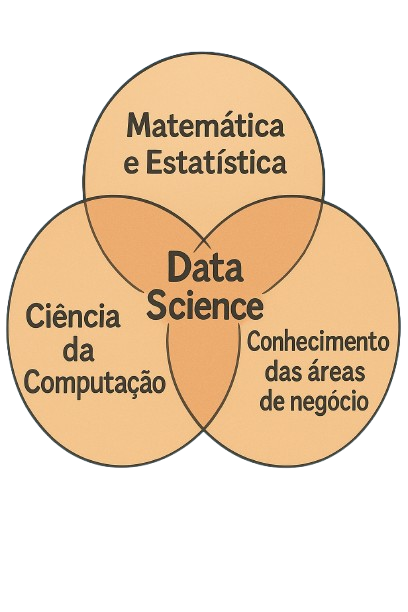
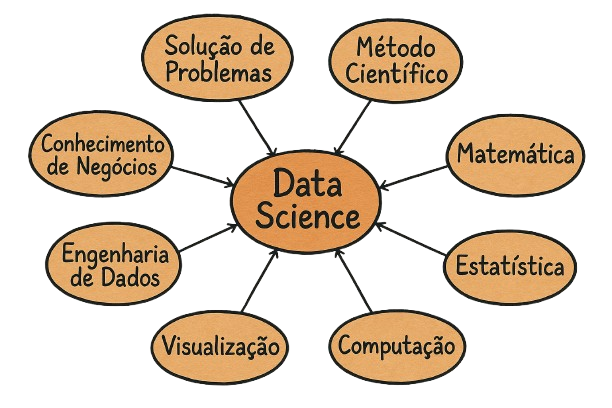

# 📊 Definição de Ciência de Dados

**Ciência de Dados** é um campo *interdisciplinar* que utiliza métodos, processos, algoritmos e sistemas para extrair conhecimento e **insights** a partir de **dados estruturados** e **não estruturados**.

Combina técnicas de **estatística**, **aprendizado de máquina**, **análise de dados** e **programação** para entender e resolver problemas complexos, auxiliando a **tomada de decisão** em diversos contextos.

Seu principal objetivo é **resolver problemas de negócio**, e pode ser aplicada em empresas de qualquer segmento — desde que exista a principal matéria-prima: **dados**.

--- 

## Termos Importantes

### 🔹 Interdisciplinar
Ciência de Dados exige conhecimento em diferentes áreas: matemática, estatística, computação, comunicação e domínio do problema (área de negócio). É isso que faz dela uma ciência interdisciplinar — ela une saberes para entender os dados de forma completa.

### 🔹 Insights
São descobertas ou compreensões profundas extraídas a partir da análise dos dados. Um insight pode revelar padrões, tendências ou informações valiosas que não eram percebidas inicialmente, ajudando a tomar decisões mais estratégicas.

### 🔹 Dados Estruturados
São dados organizados em um formato padrão, como tabelas (linhas e colunas). Exemplos:
- Planilhas do Excel
- Tabelas de bancos de dados relacionais (SQL)

Esses dados são mais fáceis de manipular com ferramentas tradicionais de análise.

### 🔹 Dados Não Estruturados
São dados que **não possuem uma estrutura predefinida**. Exemplos:
- Textos livres (como e-mails ou redes sociais)
- Imagens
- Vídeos
- Áudios

Esses dados exigem técnicas mais avançadas para extração de informações úteis, como NLP (Processamento de Linguagem Natural), visão computacional, etc.

---

# 📚 Área de Conhecimento

A Ciência de Dados é um campo que une três grandes áreas de conhecimento:

  

Embora cada uma das áreas contribua significativamente, **nenhuma delas isoladamente é suficiente para a prática da Ciência de Dados**.

- Apenas **Matemática e Estatística** com **Ciência da Computação** não são suficientes, pois a **Ciência de Dados tem como principal objetivo resolver problemas de negócio** — o que exige conhecimento do domínio específico.
- Combinar **Matemática e Estatística** com o **conhecimento das áreas de negócio** também é limitado, pois **são necessárias ferramentas e técnicas da Ciência da Computação** para processar, armazenar e manipular os dados.
- A combinação entre **Ciência da Computação** com o **conhecimento das áreas de negócio** não é suficiente, pois **faltariam as técnicas analíticas fundamentais fornecidas pela Matemática e Estatística**.

🔍 **Portanto, a Ciência de Dados é um campo interdisciplinar** que exige a integração dessas três áreas do conhecimento para gerar valor a partir dos dados.

### 📊 Matemática e Estatística
São responsáveis por fornecer as técnicas e procedimentos de cálculo, análise, correlação, transformação, limpeza e interpretação dos dados.  

### 💻 Ciência da Computação
Oferece as ferramentas e tecnologias necessárias para a implementação dos processos de análise, como:
- Programação de computadores;
- Armazenamento de dados;
- Processamento paralelo;
- Otimização de desempenho (tempo de execução dos processos de análise).

### 🏢 Conhecimento das Áreas de Negócio
Permite interpretar os dados e extrair conclusões relevantes para a tomada de decisões.  
Compreender o contexto de onde os dados vêm é essencial para formular perguntas certas e validar os resultados da análise.

### ✨ Em essência:
> A Ciência de Dados envolve o uso de métodos automatizados (**Ciência da Computação**) para analisar (**Matemática e Estatística**) grandes quantidades de dados com o objetivo de extrair conhecimento (**Área de Negócio**) a partir dos dados.

# 🔬 A Importância da Ciência em Ciência de Dados

É comum pensar que a palavra-chave em *Data Science* seja "dados" (*data*), mas, na realidade, o elemento mais essencial é a **ciência** (*science*).

📌 Em projetos de Ciência de Dados, o componente mais relevante não está necessariamente nos dados em si, mas sim na aplicação do **método científico**.  

💭 Para ilustrar essa ideia, imagine um cenário: diversos arquivos foram coletados da internet ou gerados manualmente, resultando em uma grande massa de dados armazenada em uma pasta no computador. Após alguns dias ou semanas, esses dados permanecem esquecidos e sem propósito definido.

❓ Nesse contexto, é pertinente questionar: esses dados têm algum valor por si só?

> A resposta é **não**. Dados inativos e sem análise **não produzem valor**.  
No entanto, quando são aplicadas técnicas de Ciência de Dados — utilizando **métodos científicos** e **ferramentas computacionais** — esses dados podem ser transformados em **informação**.

📈 A partir dessa informação, é possível extrair **conhecimento**, o qual orienta **tomadas de decisão** estratégicas em nível individual ou organizacional.  **É nesse ponto que reside o verdadeiro valor dos dados.**

💾 Portanto, **não basta apenas armazenar dados** em servidores ou pastas. O valor só é extraído quando há **análise estruturada e orientada por métodos científicos**.  

🔍 Justamente por isso, a **ciência** é considerada a parte mais importante do processo — e, também, a que exige **maior dedicação para ser dominada**, especialmente por quem deseja atuar profissionalmente na área.

---

## Ciência de Dados: Resolver Problemas com Ciência e Computação

A Ciência de Dados é, em sua essência, um campo voltado para a **resolução de problemas**, por meio da aplicação do **método científico e da computação**.

👩‍💻 Para profissionais com perfil analítico e gosto por desafios, a área se mostra **extremamente promissora**.  
O cientista de dados é responsável por:
- Receber um problema;
- Defini-lo com clareza;
- Buscar os dados adequados;
- Aplicar o conhecimento científico e computacional;
- E entregar **soluções que agreguem valor** e gerem impacto.

---

> 💡 **Dica:**  
> Existem dois tipos de pessoas no mundo:  
> 🔹 As que criam problemas  
> 🔹 E as que resolvem problemas!  
> 🚀  Procure sempre estar no segundo grupo — a concorrência por lá costuma ser bem menor!

---

## A Dimensão Científica da Ciência de Dados

A essência da ciência presente na Ciência de Dados se destaca na forma como cada projeto é orientado por um propósito específico: **a solução de problemas**.

  

### 🔬 Solução de Problemas e Método Científico
O ponto de partida de qualquer projeto de Ciência de Dados é a identificação de uma demanda ou problema de negócio. O cientista de dados atua com o objetivo claro de encontrar **soluções para esses desafios**, empregando o **método científico** como abordagem estruturada. Isso implica o uso de técnicas, regras e procedimentos bem definidos, que permitam não apenas gerar soluções, mas também **interpretar os resultados obtidos de maneira confiável.**

### 📐 Matemática e Estatística
Para aplicar o método científico, duas disciplinas fundamentais entram em cena: matemática e estatística. Elas fornecem a base teórica para:

🔹 Aplicação de algoritmos;

🔹 Utilização de fórmulas matemáticas;

🔹 Técnicas de análise estatística;

🔹 Interpretação de dados amostrais e populacionais;

🔹 Escolha de estratégias adequadas com base no contexto analítico.

Esse processo garante que toda a análise seja feita de forma lógica, rigorosa e cientificamente fundamentada.

### 🖥️ Computação

A execução de projetos de Ciência de Dados depende fortemente da infraestrutura computacional. O profissional da área deve possuir conhecimentos em:

🔹 Sistemas operacionais, que são a base para a execução de qualquer software ou ferramenta;

🔹 Instalação e uso de ferramentas analíticas, fundamentais para manipular, visualizar e modelar dados;

🔹 Otimização de processos, visando reduzir o tempo e o consumo de recursos em análises mais pesadas.

Em muitos casos, um processo de análise pode estar demorando mais do que o necessário. Nesses momentos, é preciso aplicar estratégias de otimização e saber utilizar os dispositivos corretos.

Por exemplo, ao treinar modelos de Inteligência Artificial, o uso exclusivo da **CPU** (*Central Processing Unit*, ou Unidade Central de Processamento) pode tornar o processo lento. A CPU é responsável por executar instruções gerais do sistema, mas nem sempre é a mais eficiente para tarefas com alta demanda computacional.

Para acelerar o treinamento, é comum utilizar também a **GPU** (*Graphics Processing Unit*, ou Unidade de Processamento Gráfico), que é especializada em executar milhares de operações simultaneamente, sendo ideal para tarefas como o treinamento de redes neurais profundas.

Entender como utilizar e combinar CPU e GPU de forma adequada é essencial para garantir eficiência, desempenho e agilidade nos projetos de Ciência de Dados.

Além disso, entender o conceito de **paralelismo** e como utilizar **threads**, que são unidades básicas de execução dentro de um processo, permite ao cientista de dados explorar ao máximo o potencial de hardware disponível. Saber dividir uma tarefa em várias threads pode reduzir significativamente o tempo de execução de um algoritmo ou visualização complexa.

### 📈 Visualização

A entrega de resultados não se limita à obtenção de conclusões estatísticas. É fundamental comunicar os achados de forma clara e acessível às áreas de negócio. Para isso, utilizam-se:

- **Visualizações** (gráficos, *dashboards*);

  - **Dashboards**:  
    São painéis interativos que reúnem várias visualizações e indicadores-chave de desempenho (KPIs) em um único lugar. Eles permitem o acompanhamento em tempo real de métricas relevantes e fornecem uma visão geral do estado atual de um processo, negócio ou projeto. Bons dashboards são intuitivos, customizáveis e focados nas necessidades do público-alvo.

- **Técnicas de _storytelling_**;

  - **Storytelling com dados**:  
     O *storytelling* é a prática de construir uma narrativa em torno dos dados, conectando visualizações de maneira lógica e envolvente para guiar o público na compreensão dos *insights*. Essa abordagem ajuda a contextualizar os resultados, respondendo às perguntas “por que isso importa?” e “o que devemos fazer a seguir?”. Uma boa história com dados envolve começo, meio e fim — com introdução do problema, análise dos dados e conclusão com recomendações. 

- **Ferramentas de comunicação de dados**.

O cientista de dados deve ser capaz de traduzir *insights* técnicos em informações compreensíveis e úteis para a tomada de decisões.

### 🛠️ Engenharia de Dados
Embora a ciência seja o centro do processo, os dados precisam estar preparados adequadamente para análise. A engenharia de dados trata das etapas de:

🔹 Extração, transformação e carga (ETL);

🔹 Limpeza e organização dos dados;

🔹 Estruturação de ambientes de armazenamento.

Essa etapa é essencial para garantir a qualidade dos dados utilizados nas análises e, muitas vezes, envolve uma estreita colaboração com engenheiros de dados.

### 💼 Conhecimento de Negócios
Para que os resultados das análises sejam relevantes, é indispensável entender o contexto do negócio. O cientista de dados precisa:

🔹 Compreender o problema que está sendo resolvido;

🔹 Estar ciente das métricas relevantes para a área envolvida;

🔹 Saber quais são os objetivos da empresa;

🔹 Estabelecer diálogo com as partes interessadas;

🔹 Buscar referências e materiais específicos quando necessário.

Esse conhecimento é adquirido progressivamente com a experiência em projetos diversos, mas exige postura proativa e mente aberta.

#### ✨ O Cientista como Tradutor de Soluções
>O trabalho do cientista de dados pode ser comparado ao de um tradutor: ele recebe um problema bruto, aplica métodos científicos e converte os dados em informações úteis para os tomadores de decisão. Esse processo é de altíssimo valor agregado, pois praticamente todas as organizações enfrentam problemas complexos diariamente e buscam por soluções baseadas em dados.

A Ciência de Dados, nesse sentido, oferece um conjunto robusto de ferramentas para transformar dados em soluções — e por isso, é uma das áreas com maior demanda e empregabilidade.

